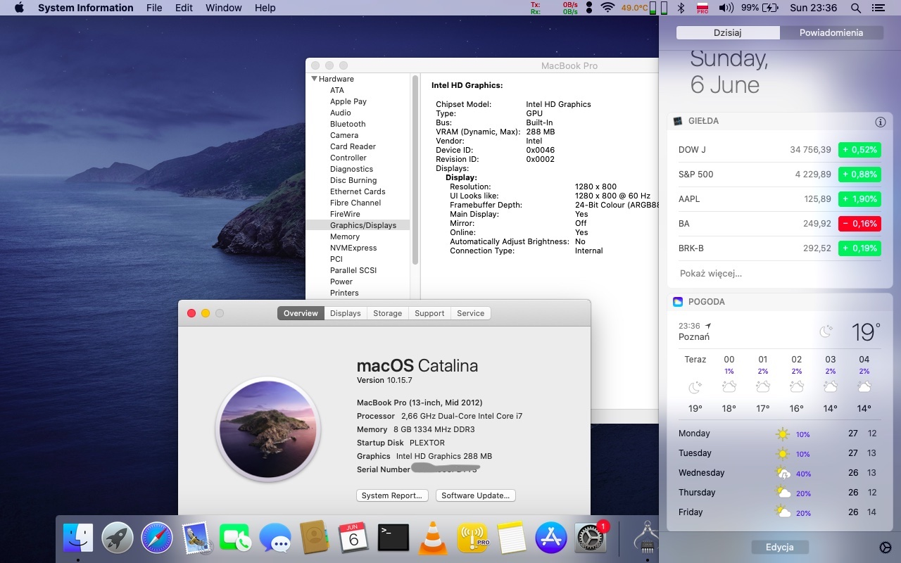

# Thinkpad-X201-Hackintosh-Catalina

=======
** Please note ** - This repo uses Clover and is for Catalina. I strongly suggest taking a look at [jtaczanowski](https://github.com/jtaczanowski)'s OpenCore EFI for the X201, capable of running Big Sur! [See the project here](https://github.com/jtaczanowski/ThinkPad-X201-Arrandale-macOS-OpenCore)

I have successfully installed Catalina on my ThinkPad X201. Previously I was running High Sierra, Catalina was around the same amount of work to get running, but the Graphics are much better even without metal support. For High Sierra, I had to inject drivers for the graphics card to get things to render, but there would still be artifacting and glitches. Catalina graphics runs perfect on the X201 with full QE/CI acceleration thanks to ASentientBot's kext patches and dosdude1 Catalina patcher.

I have my machine set to dual boot with Windows 7 on a partitioned SSD. The X201 does not have UEFI support, so the SMB partitions are all handled by clover installed to the main drive.

## Spec ##

- Intel® Core™ I7 processor I7-640LM (2.13 GHz) with dual-core
- High Definition (HD) Audio
- Conexant 20585 codec
- Volume up, down, and mute buttons
- Microphone input jack
- Headphone jack

## Wifi ##

You can use built in Intel Wifi card with AirportItlwm.kext (included)

The OEM wifi card will not work in Windows 7. I first upgraded to an Atheros AR9285 which worked natively in both Windows and OS, but it was noticably slower and lack of 5ghz support. I then upgraded to a BroadCom BCM94360HMB which is lighting fast! For Windows, you need to install the Asus AW-CMB160H drivers for it to work, it is not plug and play in Windows. For the antenna connectors, this card uses the new IPEX 4 smaller connectors. If you want to use the built in Thinkpad X201 antennas, you can fit IPEX-4 Female to IPEX-1 adaptors. There's a third antenna too which I fitted a simple IPEX 4 aerial although this is not necessary. I highly recommend the BroadCom AW-CB160 BCM94360HMB it's a very impressive wifi card, and with the SSD installed it's now a very quick machine. 

To install this wireless card, we need to inject a new BIOS into  X201. It's very easy!  Please refer to the following blog:

> https://li-aaron.github.io/2020/02/thinkpadx201i-refresh-2/

## Working ##

- Upgrades successfully to Catalina 10.15.7
- Volume control buttons
- Built in Bluetooth
- Brightness controls & all keyboard shortcuts
- Sound & Mic
- Webcam
- Bluetooth

## Not yet working: ##

Sleep - working on this! It's very fast to just shut down and boot back up again with the SSD. I can either get it to sleep but the screen doesn't turn off. I have tried the darkwake options but I need to do further investigation.

## Screen resolution ##

There are a couple of different screen resolutions for the thinkpads, mine is set to ~1440x900~ - update, I now have the 1280x800 resolution this is set in the config.plist (or edit with Clover Configurator).

## Instructions ##

1) Download the repo
2) Open config.plist in Clover Configurator. 
3) Set your SMBIOS to MacbookPro 9,2 and generate new UUID/Motherboard ID/System ID/Serials etc.

I will add more instructions to this repo if anyone finds this useful? Does anyone need dual boot instructions for Catalina and Windows 7 - that was quite tricky to get working!

## Installation  ##

1) Use dosdude's Catalina Patcher app for creating bootable usb installer with post install patches (rolling back deprecated graphics kexts, OpenGL frameworks, platform patch, etc)
    1) After the installation media is created, install clover (v5107 is recommended) into the installation media. Check the following in the installer:
        1) `clover EFI 64-bits SATA`
        2) `Boot Sectors -> Install boot0af in MBR`
    2) After the installation is complete, add the kexts in  `./EFI/CLOVER/kexts/Other` to the same path in installation media and replace  `config.plist`  by the file with same name  in this repo, or you can simply replace the entire `EFI` folder with a folder of the same name in this repo.
    3) (optional, but recommended) Use clover configurator to generate new SMBIOS content, such as serial number
    4) Use a tool like clover configurator to check the `EFI` volume in installation media. It should be empty, we just need to confirm its existence, no need to do anything.
2) Install OS
    1) It is normal for the words "Installation failed" to appear after the progress bar is completed. Please continue the installation according to the normal process.

After the steps above, although there are still problems, we already have an x201 with macOS10.15 installed. After testing, these steps are also effective for 10.14.

## Enabling QE/CI graphics acceleration

The following content is mainly used to solve the graphics driver problem. 

1) After OS is installed, run usb installer to apply post install patches (kext, frameworks).
    * Select custom patches selection - for MacBookPro6,1 (which similar to x201 has arrandale CPU/GPU)
    * Select only "Legacy Video Card Patch" and "SIP Disabler Patch"
2) After patches installation (but before reboot), select "Force Cache Rebuild".
    * Important note: If you don't select "Force Cache Rebuild", system will reboot automatically after 10s.
3) Remove entry Devices->FakeID->IntelGfx 0x12345678
4) Boot MacOS, full QE/CI acceleration should working.

Inspired by Badruzeus post on [insanelymac](https://www.insanelymac.com/forum/topic/286092-guide-1st-generation-intel-hd-graphics-qeci/?do=findComment&comment=2732732)

## Important ##

Kexts can be updated, but don't update VooDooPS2Controller. If you update this, the central red ThinkPad mouse button is no longer supported. Touch features all work, two finger scrolling etc.

## Thanks ##

Big thanks to [jtaczanowski](https://github.com/jtaczanowski) for his graphic acceleration contributions!